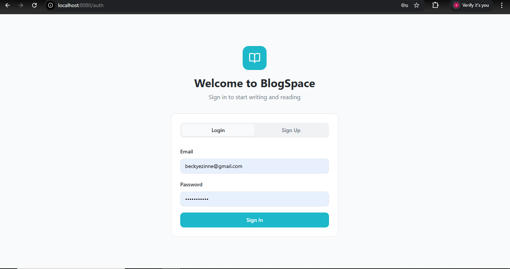
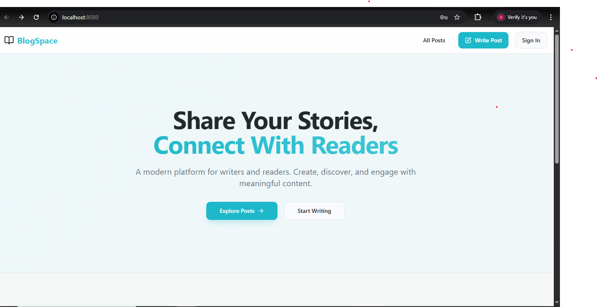

# MERN Stack Blog Application

A full-stack MERN (MongoDB, Express.js, React.js, Node.js) blog application that demonstrates seamless integration between front-end and back-end components. Features a modern React frontend with Shadcn/UI components and a robust Express.js API backend.

## 🚀 Features

- **Full CRUD Operations**: Create, read, update, and delete blog posts
- **User Authentication**: Registration and login system with JWT tokens
- **Category Management**: Organize posts by categories
- **Comments System**: Interactive commenting on blog posts
- **Image Uploads**: Featured images for blog posts
- **Search & Filtering**: Find posts by keywords and categories
- **Pagination**: Efficient loading of large post lists
- **Responsive Design**: Modern UI with Tailwind CSS and Shadcn/UI
- **Real-time Updates**: Optimistic UI updates for better UX

## 🛠️ Tech Stack

### Frontend
- **React 18** - Modern React with hooks
- **Vite** - Fast build tool and dev server
- **React Router** - Client-side routing
- **TanStack Query** - Data fetching and caching
- **Shadcn/UI** - Modern UI components
- **Tailwind CSS** - Utility-first CSS framework
- **Axios** - HTTP client for API calls

### Backend
- **Node.js** - JavaScript runtime
- **Express.js** - Web framework
- **MongoDB** - NoSQL database
- **Mongoose** - MongoDB object modeling
- **JWT** - JSON Web Tokens for authentication
- **bcryptjs** - Password hashing
- **multer** - File upload handling

## 📁 Project Structure

```
mern-stack-integration-marahcodez/
├── client/                 # React frontend (if separate client folder exists)
├── server/                 # Express.js backend
│   ├── models/            # Mongoose models
│   │   └── Post.js        # Post model with comments, categories
│   ├── routes/            # API route handlers
│   ├── middleware/        # Custom middleware
│   ├── controllers/       # Route controllers
│   ├── config/            # Configuration files
│   └── server.js          # Main server file
├── src/                   # React source code
│   ├── components/        # Reusable React components
│   │   ├── ui/           # Shadcn/UI components
│   │   ├── Navbar.jsx    # Navigation component
│   │   └── PostCard.jsx  # Post preview component
│   ├── pages/            # Page components
│   │   ├── Index.jsx     # Landing page
│   │   ├── Posts.jsx     # Posts listing
│   │   ├── PostView.jsx  # Single post view
│   │   ├── PostForm.jsx  # Create/edit post form
│   │   ├── Auth.jsx      # Authentication page
│   │   └── NotFound.jsx  # 404 page
│   ├── hooks/            # Custom React hooks
│   ├── services/         # API service layer
│   │   └── api.js        # Axios configuration and API calls
│   └── App.jsx           # Main app component
├── public/                # Static assets
├── Screenshots/           # Application screenshots
└── package.json           # Dependencies and scripts
```

## 🔧 Setup Instructions

### Prerequisites

- **Node.js** (v18 or higher)
- **MongoDB** (local installation or MongoDB Atlas)
- **npm** or **yarn**

### Installation

1. **Clone the repository**
   ```bash
   git clone <repository-url>
   cd mern-stack-integration-marahcodez
   ```

2. **Install dependencies**
   ```bash
   npm install
   ```

3. **Environment Setup**

   Create a `.env` file in the root directory:
   ```env
   # Database
   MONGODB_URI=mongodb://localhost:27017/mern-blog

   # JWT
   JWT_SECRET=your-super-secret-jwt-key-here
   JWT_EXPIRE=30d

   # Server
   PORT=5000
   NODE_ENV=development

   # Frontend (if using separate client)
   VITE_API_URL=http://localhost:5000/api
   ```

4. **Start MongoDB**
   Make sure MongoDB is running on your system.

5. **Run the application**
   ```bash
   npm run dev
   ```

   This will start the development server on `http://localhost:5173` (Vite default).

### Alternative: Separate Client/Server Setup

If you have separate client and server folders:

1. **Backend Setup**
   ```bash
   cd server
   npm install
   npm run dev
   ```

2. **Frontend Setup**
   ```bash
   cd client  # or root if client is in src/
   npm install
   npm run dev
   ```

## 📡 API Documentation

### Authentication Endpoints

#### POST `/api/auth/register`
Register a new user account.

**Request Body:**
```json
{
  "name": "John Doe",
  "email": "john@example.com",
  "password": "password123"
}
```

**Response:**
```json
{
  "success": true,
  "token": "jwt-token-here",
  "user": {
    "id": "user-id",
    "name": "John Doe",
    "email": "john@example.com"
  }
}
```

#### POST `/api/auth/login`
Authenticate user login.

**Request Body:**
```json
{
  "email": "john@example.com",
  "password": "password123"
}
```

**Response:** Same as register response.

### Post Endpoints

#### GET `/api/posts`
Get all posts with optional pagination and filtering.

**Query Parameters:**
- `page` (number): Page number (default: 1)
- `limit` (number): Posts per page (default: 10)
- `category` (string): Filter by category ID

**Response:**
```json
{
  "success": true,
  "data": [
    {
      "id": "post-id",
      "title": "Post Title",
      "content": "Post content...",
      "excerpt": "Post excerpt...",
      "slug": "post-title",
      "featuredImage": "image-url",
      "author": {
        "id": "author-id",
        "name": "Author Name"
      },
      "category": {
        "id": "category-id",
        "name": "Category Name"
      },
      "tags": ["tag1", "tag2"],
      "isPublished": true,
      "viewCount": 42,
      "comments": [...],
      "createdAt": "2024-01-01T00:00:00.000Z",
      "updatedAt": "2024-01-01T00:00:00.000Z"
    }
  ],
  "pagination": {
    "page": 1,
    "limit": 10,
    "total": 25,
    "pages": 3
  }
}
```

#### GET `/api/posts/:id`
Get a single post by ID or slug.

**Response:** Single post object (same structure as above).

#### POST `/api/posts`
Create a new blog post. (Requires authentication)

**Request Body:**
```json
{
  "title": "New Post Title",
  "content": "Post content in markdown or HTML",
  "excerpt": "Optional short description",
  "category": "category-id",
  "tags": ["tag1", "tag2"],
  "isPublished": true,
  "featuredImage": "image-file-or-url"
}
```

#### PUT `/api/posts/:id`
Update an existing post. (Requires authentication, author only)

**Request Body:** Same as create, all fields optional.

#### DELETE `/api/posts/:id`
Delete a post. (Requires authentication, author only)

#### POST `/api/posts/:postId/comments`
Add a comment to a post. (Requires authentication)

**Request Body:**
```json
{
  "content": "This is my comment"
}
```

#### GET `/api/posts/search?q=search-term`
Search posts by title, content, or tags.

### Category Endpoints

#### GET `/api/categories`
Get all categories.

**Response:**
```json
{
  "success": true,
  "data": [
    {
      "id": "category-id",
      "name": "Technology",
      "description": "Posts about technology",
      "slug": "technology",
      "postCount": 15
    }
  ]
}
```

#### POST `/api/categories`
Create a new category. (Requires authentication, admin only)

**Request Body:**
```json
{
  "name": "New Category",
  "description": "Category description"
}
```

## 🎨 Frontend Components

### Core Components

- **Navbar**: Navigation with authentication state
- **PostCard**: Post preview with title, excerpt, and metadata
- **PostForm**: Rich form for creating/editing posts
- **Auth**: Login/register forms with validation

### Pages

- **Index**: Landing page with hero section and features
- **Posts**: Grid layout of all posts with filtering
- **PostView**: Detailed post view with comments
- **Auth**: Authentication page
- **NotFound**: 404 error page

## 🔐 Authentication

The application uses JWT (JSON Web Tokens) for authentication:

1. **Registration/Login**: Users receive a JWT token
2. **Token Storage**: Stored in localStorage
3. **API Requests**: Automatically included in Authorization header
4. **Protected Routes**: Redirect to login if token invalid/expired

## 📸 Screenshots

### Landing Page


### Working Application


## 🚀 Deployment

### Backend Deployment
1. Set `NODE_ENV=production` in environment
2. Use a production MongoDB instance (MongoDB Atlas)
3. Deploy to services like Heroku, Railway, or Vercel

### Frontend Deployment
1. Build the production bundle: `npm run build`
2. Deploy to Netlify, Vercel, or any static hosting service
3. Configure API base URL for production

## 🤝 Contributing

1. Fork the repository
2. Create a feature branch
3. Make your changes
4. Add tests if applicable
5. Submit a pull request

## 📄 License

This project is licensed under the MIT License.

## 📞 Support

For questions or issues, please open an issue on GitHub:
https://github.com/marahcodez


---

**Note**: This application is built as part of a MERN stack integration assignment, demonstrating full-stack development with modern React patterns, RESTful API design, and MongoDB integration.